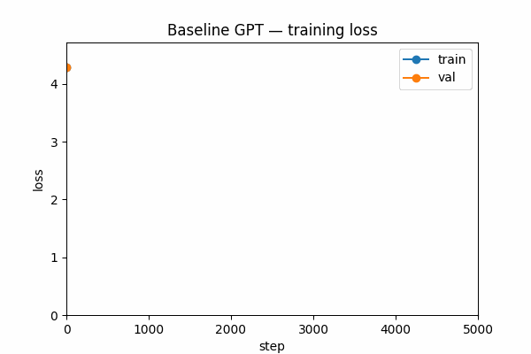

# nanoGPT — training a real LLM from scratch

Building a full GPT language model — character-level, trained on tiny_shakespeare — and watching it go from random noise to something that reads like Shakespeare (badly, but recognizably).

Unlike the previous repo where every piece was verified in isolation, this one trains end to end. The loss curve is the proof.

## What it does

- Character-level tokenizer, no subword complexity — the point here is the architecture, not the tokenizer
- Full causal Transformer block: LayerNorm → Multi-Head (masked) Attention → residual → LayerNorm → FeedForward → residual
- GPT assembly: token embedding + position embedding, stacked blocks, final LM head
- Trained for 5000 steps on a Kaggle T4 GPU, train/val loss logged every 500 steps
- Text generation with temperature sampling
- A second version swaps learned position embeddings for RoPE (Rotary Position Embedding) and compares perplexity against the baseline

## Why train on Kaggle

This model (6 layers, 384-dim embeddings, ~10M parameters) would take hours on CPU. Kaggle gives 30h/week of free T4 GPU — training the full 5000 steps takes roughly 20-30 minutes there.

## Results

Trained on a Kaggle T4 (10.79M parameters baseline, 10.69M with RoPE — it drops the position embedding table).

| Model | Steps | Train loss | Val loss | Perplexity |
| --- | --- | --- | --- | --- |
| Baseline (learned pos. embedding) | 5000 | 0.87 | 1.55 | 4.73 |
| RoPE | 2000 | 1.15 | 1.48 | 4.39 |

RoPE reaches a *lower* validation loss in less than half the training steps. Not a fully fair comparison (different step counts), but a strong signal for why models like Mistral and Llama use it instead of learned position embeddings.



Sample output (baseline, temperature 0.8):

```text
What's her father? 'Be madline; I were come for't:
What, sir, what you offend.

GLOUCESTER:
The curet beauty that fill'd at my career,
Is nine mouths to course in court?
```

Not real Shakespeare, obviously — but it nails the dialogue format, character name headers, and line rhythm from nothing but 1MB of raw text and a next-character prediction objective.

## Stack

PyTorch 2.x · Kaggle T4 GPU · matplotlib

## Recruiter demo

Generate text live, show the loss curve GIF, explain why we divide attention scores by √d_k and why RoPE encodes position differently than a learned embedding table.
